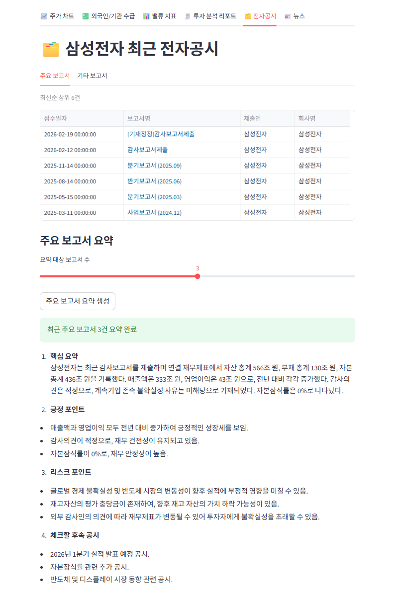
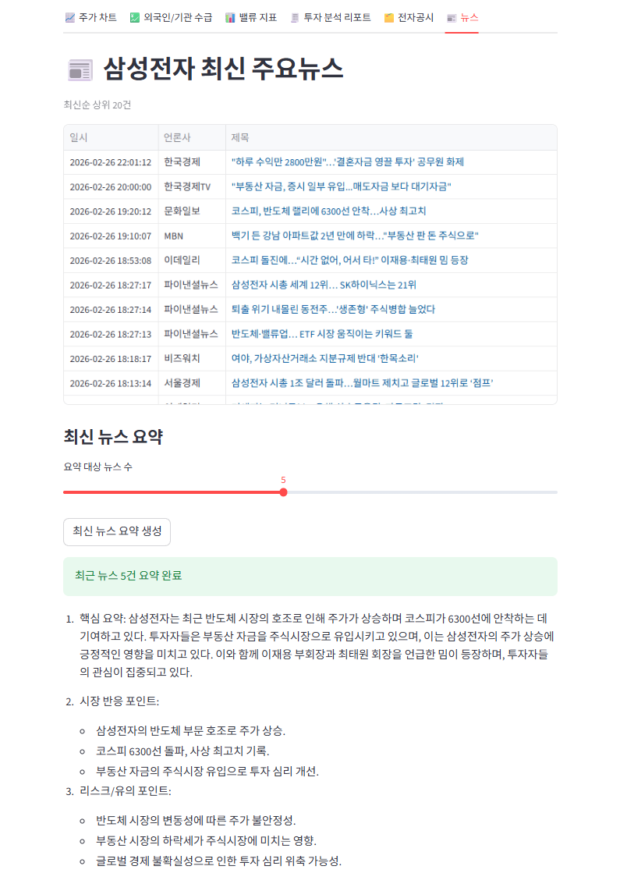

# 금융 공시/뉴스 분석 Streamlit 앱

하나의 Streamlit 앱에서 종목별로 `주가`, `수급`, `밸류 지표`, `전자공시`, `뉴스`, `투자 분석 리포트`를 확인할 수 있는 프로젝트입니다.

## 현재 구현 기능

### 1) 종목 선택 (사이드바)
- `종목유형`: `주식`, `ETF`
- 종목 목록 소스: **KRX: KOSPI**
  - 주식: KOSPI 종목 목록
  - ETF: KOSPI ETF 목록
- 정렬: `시가총액`, `거래대금`, `거래량`, `이름`
  - 시가총액/거래대금/거래량 정렬은 KIS 랭킹 API 사용
  - KIS 키가 없거나 호출 실패 시 이름순 fallback


### 2) 주가 차트 탭
- KIS 일봉 데이터 조회
- 실시간 현재가/등락 표시
- 기간 슬라이더 기반 차트 + 최근 데이터 테이블


### 3) 외국인/기관 수급 탭
- KIS 수급 데이터 조회
- 외국인/개인/기관 순매수 추이 표시
- 최근 수급값 요약 + 테이블


### 4) 밸류 지표 탭 (주식만 표시)
- 표시 지표: `PER`, `PBR`, `EV/EBITDA`
- 주석(산출식/설명) 표시
- 데이터 소스
  - PER/PBR: KIS 현재가 조회
  - EV/EBITDA: KIS 기타 주요비율
- **ETF 선택 시 탭 자체를 숨김**


### 5) 투자 분석 리포트 탭
- 네이버 금융 주요 뉴스 + KIS 수급을 결합한 규칙 기반 리포트
- 시장 심리 %, 의견(매수 우위/관망/매도 우위), 신뢰도, 최근 감성 추이
- 관련 뉴스가 부족한 경우 보수적 fallback 로직 적용


### 6) 전자공시 탭
- OpenDART 기반 공시 조회
- 주식: 종목코드/종목명 기반 공시 조회
- ETF: 펀드 공시(kind=`G`)를 최근 구간(30/90일)에서 ETF명 매칭
- 주요 보고서 요약(OpenAI API 설정 시)



### 7) 뉴스 탭
- 네이버 금융 주요 뉴스 수집
- 기사 링크 제공
- 최신 뉴스 요약(OpenAI API 설정 시)



---

## 데이터 소스
- 종목 목록: `KRX`
- 주가/수급/밸류 지표: `한국투자증권(KIS) Open API`
- 전자공시: `OpenDART`
- 뉴스: `네이버 금융`
- 요약: `OpenAI API` (선택)

---

## 실행 방법

### 1) 가상환경 생성
```bash
python -m venv venv
```

### 2) 가상환경 활성화
```bash
source venv/Scripts/activate
```

### 3) 패키지 설치
```bash
pip install -r requirements.txt
```

### 4) `.env` 설정
프로젝트 루트에 `.env` 파일 생성:

```env
OPENDART_API_KEY=your_opendart_key
OPENAI_API_KEY=your_openai_key
KIS_APP_KEY=your_kis_app_key
KIS_APP_SECRET=your_kis_app_secret
KIS_ENV=real
```

### 5) 앱 실행
```bash
streamlit run main.py
```

접속: `http://localhost:8501`

---

## 환경변수 설명
- `OPENDART_API_KEY`: 전자공시 조회에 필요
- `OPENAI_API_KEY`: 공시/뉴스 요약 기능에 필요 (없어도 조회는 가능)
- `KIS_APP_KEY`, `KIS_APP_SECRET`: 주가/수급/밸류/정렬 랭킹에 필요
- `KIS_ENV`: `real` 또는 `demo` (미설정 시 `real`)

참고:
- 코드에서 `KIS_APPKEY`, `KIS_APPSECRET`도 호환합니다.

---

## 프로젝트 구조
- `main.py`: 앱 진입점, API 호출/가공 로직
- `tabs/price_chart.py`: 주가 차트 탭
- `tabs/flow.py`: 외국인/기관 수급 탭
- `tabs/valuation.py`: 밸류 지표 탭
- `tabs/report.py`: 투자 분석 리포트 탭
- `tabs/disclosure.py`: 전자공시 탭
- `tabs/news.py`: 뉴스 탭
- `requirements.txt`: 의존성 목록

---

## 주의사항
- KIS/OpenDART/OpenAI 호출은 외부 API 상태에 따라 실패할 수 있습니다.
- OpenAI 요약 호출 시 `429 insufficient_quota`가 발생하면 API 사용량/결제 상태를 확인하세요.
- 뉴스/공시 수집은 원본 사이트 구조 변경 시 영향받을 수 있습니다.
